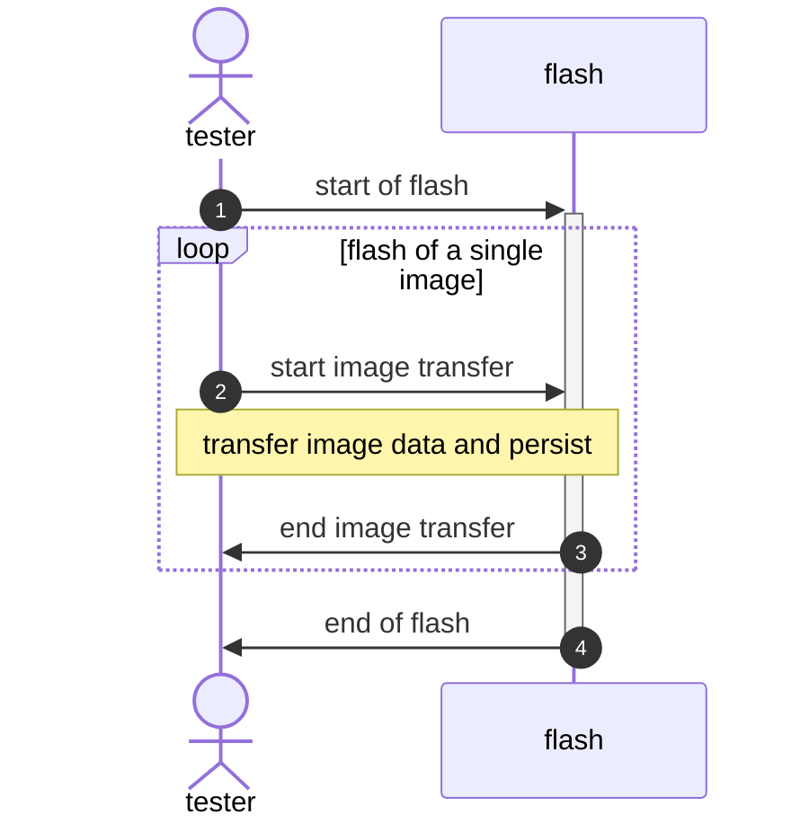
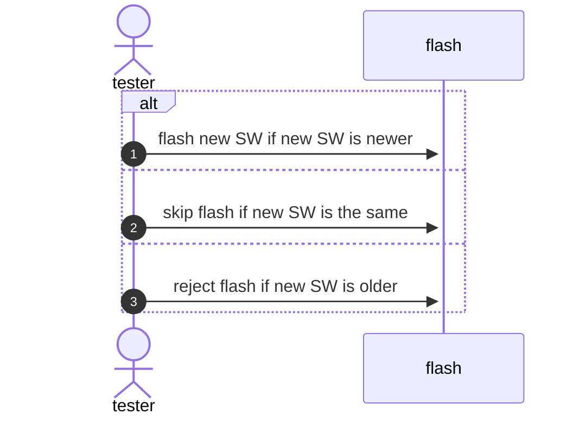

import TOCInline from '@theme/TOCInline'

# Sequence detection (DLT logs based)

## Introduction

In software engineering [sequence diagrams](https://en.wikipedia.org/wiki/Sequence_diagram) are often used to describe events occurring for a specific use-case. For those events the order of occurrence from start of the use-case to the end or error cases are defined.

In the context of log analysis, a sequence typically refers to a series of related log entries that represent a specific event coming from the flow of code executed. 

Sequences are often used in log analysis to:

1. Track the execution flow: By following a sequence of log entries, you can understand how a particular process or operation is executed within the system.
2. Identify patterns: Sequences can help identify common patterns or behaviors in the system, which can be useful for performance optimization or troubleshooting.
3. Detect anomalies: By comparing sequences, you can detect deviations from the expected behavior, which may indicate potential issues or errors in the system.
4. Correlate events: Sequences can help correlate events across different components or services, providing a holistic view of the system's behavior.

## Target

The target of sequence detection is to identify sequences for use-cases from the event logs.

This eases the log based analysis for

1. faster understanding where a specific use-case failed,
2. confirming that the use-cases executed properly.

## Sequence definition

The [dlt-logs](https://mbehr1.github.io/dlt-logs/), [fba-cli](https://github.com/mbehr1/fba-cli) and fishbone extensions support [REST query](/docs/badges#manual-edit-of-dlt-query) based sequence definition.

### sequence attributes
A `sequence` is defined via the following attributes:

attribute | description
--------- | -----------
`name` | Name of the sequence. Should be well defined as all sequences share the same namespace and the DLT-logs extension shows the results in the tree view under Events/Sequences/name.
`steps` | Array with objects defining the events aka steps. Those steps are checked for being executed in order. See [step definition](#step-definition)
`failures` |  Object/map with filters defining a possible failure for the sequence. The object key defines the name of the failure and the key value defines the filter used to detect that. See [failures definition](#failures-definition)
`globalFilters`| Optional array with filters that are applied first. Main intention is to use neg. filters here to filter for attributes.ecu or attributes.lifecycles.id. `{type: 1, not: true, ecu: ${attributes.ecu}}` or `{type: 1, not: true, lifecycles: ${attributes.lifecycles.id}}` This allows to apply the filters ECU/lifecycles for fishbones.
`kpis`| Optional array with KPI definitions that are evaluated per occurrence. See [KPI definition](#kpi-definition) for details.

An example with one failure but without step details :

```jsonc {4,5,7}
/get/docs/0/filters?
sequences=[
  {
    "name": "SW Update",
    "steps":[ // array with one object per step...
    ],
    "failures":{
      "crash":{ // a dlt filter definition like:
        "type":3, // event
        "apid":"SYS",
        "ctid":"JOUR",
        "payloadRegex":"^process '.*?' crashed"
      }
    }
  }
]
```

### `step` definition

A `step` has the following attributes:

attribute | description
--------- | -----------
`name` | Optional: Name of this step. If not provided name of the filter or name of the contained sequence will be used.
`card` | Optional: Cardinality of this step. Defaults to "exactly once/mandatory step" if not provided. Can be any of:<br/>`?`:zero or once, so an optional step,<br/>`*`:any number of times = 0.., so an optional step that can occur not at all or any number of times<br/>`+`:once or multiple times, so a mandatory step that can occur multiple times but at least once
`canCreateNew` | Optional: Determines whether this step can create a new sequence occurrence. Defaults to `true`. Must not be `false` for the first step in a sequence. Set to `false` if this step shall only be checked for a created occurrence from an earlier step. So the `filter`, `sequence`, `alt` or `par` will be ignored then.
`ignoreOutOfOrder` | Optional: if true, any matches/occurrences of this step that are out of order/sequence are ignored. Can only be used if the step before this step is mandatory. Defaults to `false`. This can be used if some messages occur often but you expect it exactly after one step and you do ignore any other occurrences.
`filter` | [DLT filter](https://mbehr1.github.io/dlt-logs/docs/filterReference#details) definition. If this filter matches a msg the step is seen as "matching". Either `filter`, `sequence`, `alt` or `par` must be provided.
`sequence` | A definition of a `sub-sequence`. For this step a full sequence is used. This is useful to either break down a bigger sequence into smaller parts or if this step can be executed multiple times (e.g. with `card:*`) but consists of multiple events/steps. See [example](#example).
`alt` | A definition for a list of alternative steps. The `alt` attribute is an array/list of step definitions. Any `card` or `canCreateNew` attribute will automatically be applied to the alternative steps. For this step to be `ok` exactly one step needs to be `ok`. See [example alt](#example-alternative-steps).
`par` | A definition for a list of parallel steps. The `par` attribute is an array/list of step definitions. Single steps can have their own `card` or `canCreateNew` attribute and the step with `par` as well. For this step to be `ok` all mandatory steps ( `card` not `?,*` ) need to be `ok`. The order in which the parallel steps are fulfilled doesn't matter.

:::important
A step must contain either a filter or a sub-sequence or an alt-list but not more than one!
:::

:::caution
Optional steps are not allowed at the end of the sequence \/ end of the steps list.

The sequence will be detected with the last mandatory step as `done` so the optional steps at the end would never be matched.
:::

### `failures` definition

The failures attribute consists of a name/filter mapping like:

```jsonc {2,6}
{
  "error1": { // DLT filter definition for 'error1'
    "type":3,
    // more dlt filter attributes like apid, ctid, payloadRegex
  },
  "error2": { // DLT filter definition for 'error2' 
    "type":3,
    // more dlt filter attributes...
  }
}
```

Each failures object members is a [DLT filter](https://mbehr1.github.io/dlt-logs/docs/filterReference#details) object.
If this filter matches a log message the sequences is aborted with the failure name from the object key.

E.g. for
```jsonc {7,8}
/get/docs/0/filters?
sequences=[
  {
    "name": "SW Update",
    "steps":[ // one object per step...
    ],
    "failures":{
      "crash":{ // a dlt filter definition like:
        "type":3, // event
        "apid":"SYS",
        "ctid":"JOUR",
        "payloadRegex":"^process '.*?' crashed"
      }
    }
  }
]
```
the sequence `SW Update` will fail with error `crash` if a log message from `SYS/JOUR` starting with payload "process '...' crashed" occurs.

:::note
Only a started sequence gets aborted with any of the defined failures. If the failures occur without a started sequence they are ignored.
:::

#### failure capturing data

Failure filters can capture data similar to [context](#context):

E.g. for
```jsonc {7,8,12}
/get/docs/0/filters?
sequences=[
  {
    "name": "SW Update",
    "steps":[ // one object per step...
    ],
    "failures":{
      "crash":{ // a dlt filter definition like:
        "type":3, // event
        "apid":"SYS",
        "ctid":"JOUR",
        "payloadRegex":"^process '(?<crash_process>.*?)' crashed with signal (?<crash_signal>.*)"
      }
    }
  }
]
```

A message like
```
SYS JOUR process 'foo' crashed with signal 6
```

will lead to a failure

`crash: "crash_process":"foo", "crash_signal": "6"`

and `crash_process` and `crash_signal` are added to the [context](#context) as well.

### `kpi` definition

A `kpi` has the following attributes:

attribute | description
--------- | -----------
`name` | Name of this `kpi`.
`duration`| Optional object for `duration` KPIs. Those KPIs measure a time distance/duration.

Later on other kpi types than `duration` will be defined. That's why `duration` is optional. Currently it's the only supported type so it needs to be defined.

A `duration` has the following attributes:

attribute | description
--------- | -----------
`start`| Optional start marker. If not provided the timestamp from the `end` marker is used.
`end`| string expression to use as the `end` of the duration. 

`start` and `end` can be specified with the following syntax: 

`start(s#<stepnr>)`: defines the start event time of the sequence step with the specified nr.
`end(s#<stepnr>)`: defines the end event time of the sequence step with the specified nr.

E.g. the following definition defines a KPI named `flash duration` that measures the duration from start of step #1 to end of step#3.

```jsonc {5,6,7,8,9,10,11,12,13}
/get/docs/0/filters?
sequences=[
  {
    "name": "SW Update",
    "kpis":[
      {
        "name": "flash duration",
        "duration": {
          "start": "start(s#1)",
          "end": "end(s#3)"
        }
      }
    ],
    "steps":[ // one object per step...
    ],
    "failures":{
    }
  }
]
```

:::note
`end(s#...)` is for `filter` based steps the same as `start(s#...)`. But if the step is e.g. a sub-sequence or a parallel step the end is the last event/msg for that step.

So it's good practice to use `end(...)` instead of `start(...)` for the `duration.end`.
:::


### example

See here an example for a very basic flash sequence consisting of:



Filters/failures are ommited.

Here `sub-sequences` are used to ensure that if image x is flashed it's mandatory to have a start and end of the transfer.

```jsonc {7,11,12,13,16,20,28}
/get/docs/0/filters?
sequences=[
  {
    "name": "SW Update",
    "steps":[
      { // step 1 mandatory:
        "name":"start of flash",
        "filter":// filter to detect flash sequence start
      },
      { // step 2 multiple times 
        "card":"+", // multiple but at least 1 image needs to be flashed
        "sequence":[
          "name": "flash of image",
          "steps":[
            { // sub-step 2.1
              "name":"transfer start",
              "filter":// filter to detect start of transfer
            },
            { // sub-step 2.2 = 3
              "name":"transfer end",
              "filter":// filter to detect start of transfer
            }
          ],
          "failures":{}
        ]
      },
      { // step 3 (=4 in seq chart)
        "name":"end of flash",
        "filter":// filter to detect end of flash sequence
      },
    ],
    "failures:{} // ommitted here
    ,
  }
]
```

### example alt(ernative) steps

See here an example for the `alt` attribute of a step:



```jsonc {8,10,14,18,21}
/get/docs/0/filters?
sequences=[
  {
    "name": "SW Update",
    "steps":[
      { // this step is an alternative step with 3 alternatives:
        "name":"flash",
        "alt":[
            { // alt step 1
              "name":"flash new SW if new SW is newer",
              "sequence":// e.g. sub-sequence to detect if flash was started with newer SW
            },
            { // alt-step 2
              "name":"skip flash if new SW is the same",
              "filter":// filter to detect skip of SW
            },
            { // alt-step 3
              "name":"reject flash if new SW is older",
              "filter":// filter to detect rejection...
            }
          ]
      }
    ],
    "failures:{} // ommitted here
    },
  }
]
```

### context

Any filter payload regex can capture `context` via capture group names.

This will be added as info to the report details.

This can e.g. be used to capture file names transferred or similar dynamic data.

Context values collected are stored as per detected sequence in a key/value storage.
The capture group name is used as the key of the key/value storage.
If multiple values are capture with the same name only the last value is stored.

:::info
Capture group names starting with '_' are treated in a special way:

If they are captured multiple times they need to match the first captured value otherwise the sequence is aborted with an error.
:::

TODO add examples showing how this can be used to enfores that e.g. returned handles are the same for a request.

## REST query sequence return values

todo describe `seqSummary`

## Using sequences

The intended way to use sequences with fishbones is to define them as part of the upper or lower badge for a root cause.
As soon as the root cause is visible the sequence detection will be executed automatically and the summary shown as part of the [badge](/docs/badges)

To do so use a badge with
- extension dlt-logs rest query
- edit the sequence manually or via `EDIT IN NOTEBOOK`
- use json path: `$.data[*]`
- use javascript function:
```javascript
const summaries=result.filter((t)=>t.type==='seqSummary').map((d)=>d.attributes)
return ''+summaries.map((s)=>`${s.name}:${s.summary}`).join(',')
```
This will show the sequence execution summaries as part of the badge label.

### full report via dlt-logs extension
The full report for a sequence execution is available in the tree-view under `Events`\/`Sequences`\/name and can be browsed there or exported in markdown format.

TODO: picture or link to dlt-logs docs.

### full report via fba-cli tool
The `fba-cli` tool executes the full fishbone including the sequences and will contain a report in markdown format for the sequence.

TODO: ... more details, links, examples

## Testing sequence definitions

It's easiest to test the definition of the sequence and the execution by opening it in the fishbone/edit badges/notebooks. There you can execute it in real time.

TODO ... add example picture.

## FAQs

<TOCInline
  toc={toc.filter((node) => node.level === 4 && node.id.startsWith('q-'))}
  minHeadingLevel={4}
  maxHeadingLevel={4}
/>

#### Q: What does `ERROR: Step out of order` mean?

A: It indicates that a next/later step occurs before current/next step.

E.g. in a sequence with 3 steps: s1, s2, s3\
and message matching: s1, s3, s2, s3

The sequence occurrence started with s1, s3 will throw that error on processing s2 as step 2 came in after step 3.

This can be resolved in multiple ways:
 
 - "ignoreOutOfOrder": true
 
   If you define s3 with `ignoreOutOfOrder:true` and occurrences of this step that are not in order are ignored. E.g. the sequence s1, s3, s2, s3 is matched as: s1, (s3 ignored), s2, s3 (now in order).

- usage of a parallel step

  E.g. if step 2 and step 3 are not logically sorted / can happen in any order you can use a parallel step with those:
  ```jsonc
  {
    name: "e.g. step 2 and step 3 in any order",
    par:[
      { // step 2 definition
      },
      {
        // step 3 definition
      }
    ]
  }
  ```

#### Q: How to ensure that a step does not create a new sequence occurrence?

A: By default every step within a sequence can create a new occurrence.

E.g. in a sequence with 3 steps: s1, s2 and s3\
and messages matching: s2 and s3

Step 2 will create a new occurrence of the sequence (that can never become 'ok' as the first step is missing).
This is on purpose as there are often logs that miss the start of the sequence.

If you want to avoid that you can use  `"canCreateNew":false` in the step definition for all steps except the first one.

#### Q: How to escape chars in regex?

A: Whenever you do use strings in a json definition like the `payloadRegex` you do need to escape all json special characters `", \, /`.

E.g. `\d` needs to be written as `\\d`.

For more complex examples or if in doubt e.g. the [online json escape](https://www.lambdatest.com/free-online-tools/json-escape) helps.

#### Q: What does `step#x exceeded max cardinality 1` mean?

A: By default each step within a sequence has a "cardinality" of 1. This means it needs to be exactly once within an occurrence of the sequence.

E.g. in a sequence with 3 steps: s1, s2 and s3\
and messages matching: s1, s2, s2 and s3

you will get that error for step 2 as it occurs twice but is expected exactly once.

By setting `card` for step 2 to e.g. `"card":"+"` (>=1 times) or `"card":"*"` (>=0 times) the step can be allowed to occur multiple times at that position (after step 1 and before step 3).
